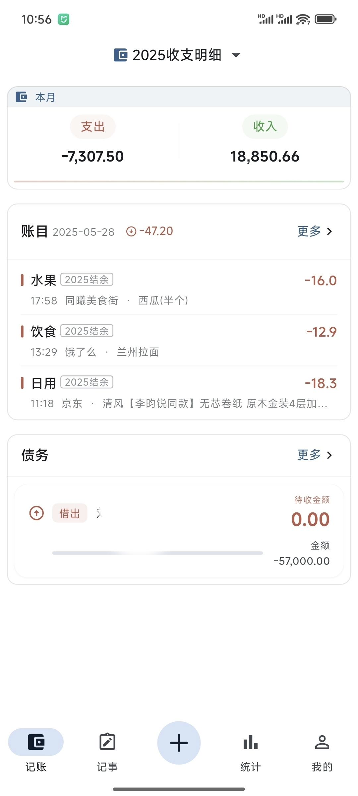
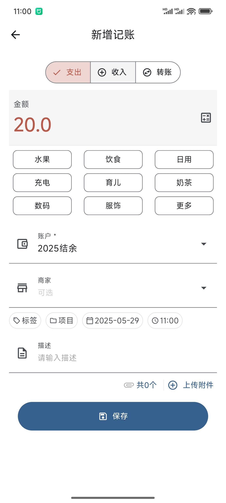
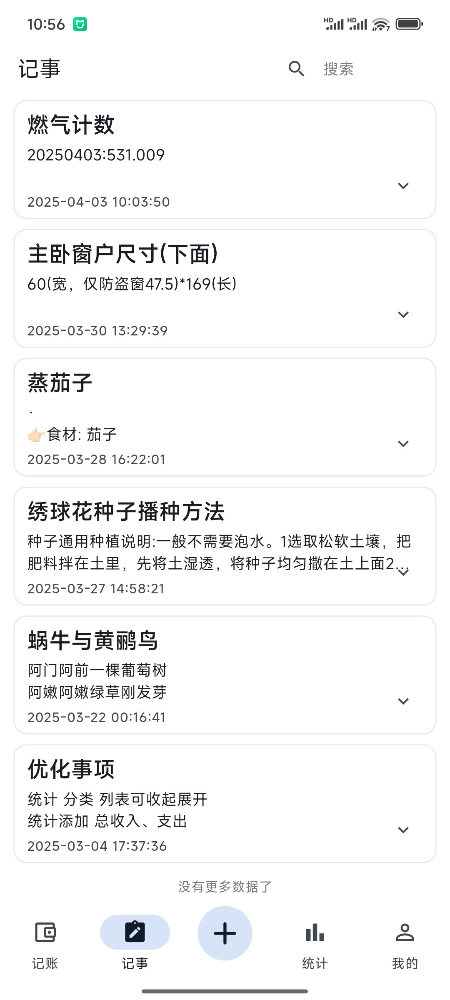
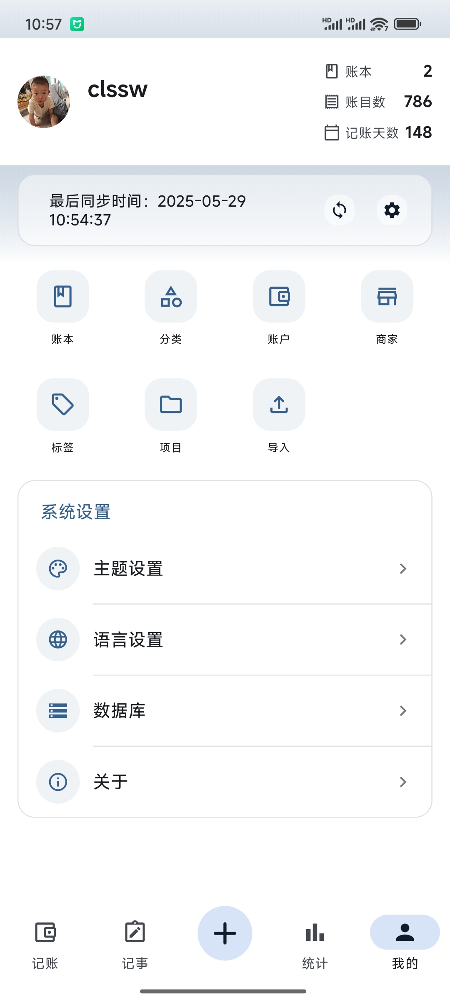
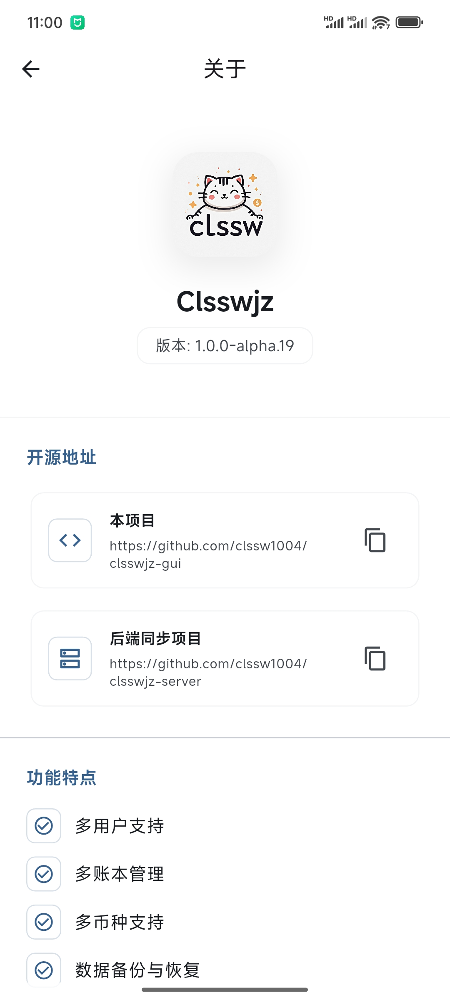

# Clsswjz

一个基于 Flutter 开发的可本地私有化部署托管的现代化记账记事应用，支持多账本管理、记事、简单的债务管理等功能；


## 功能特点 ✨
- 🌐 **多端同步**
  - 服务都支持私有服务器部署，可部署在NAS或服务器上（后端基于nodejs，支持docker部署）
  - 数据实时同步
  - 离线使用

- 📚 **多账本管理**
  - 支持创建多个账本
  - 账本间数据互相独立
  - 支持账本共享与协作

- 💰 **记账功能**
  - 支持收入、支出、转账记录
  - 自定义分类管理
  - 支持标签、商家、项目等多维度记录
  - 支持附件（票据、图片等）

- 📝 **记事功能**
  - 支持笔记和待办事项
  - 富文本编辑
  - 标签分类

- 💳 **债务管理**
  - 借入借出记录
  - 还款/收款跟踪
  - 债务状态管理

- 📊 **数据统计**
  - 收支趋势分析
  - 分类占比统计
  - 自定义时间范围

- 🎨 **个性化**
  - Material Design 3 设计
  - 自定义主题颜色
  - 深色模式支持

## 下载最新版本([Release 页面](https://github.com/clssw1004/clsswjz-gui/releases))
  * 目前只有android端与IOS端经过测试：
    * android端目前Google Play上架内测中；
    * IOS端由于需要开发者账户暂无上架打算，可自行编译

## 后端私有化部署
见[clsswjz-server](https://github.com/clssw1004/clsswjz-server)，提供编译好的docker镜像直接部署，可部署在NAS上（需支持docker）或闲置服务器

## 支持语言
* English
* 简体中文
* 繁体中文


## 页面截图
### 账目页面




### 记事页面


### 统计页面


### 我的页面


### 关于



## 本地编译 🚀

### 环境要求

- Flutter 3.x
- Dart 3.x
- Android Studio / VS Code
- Android SDK / Xcode（取决于目标平台）

### 安装步骤

1. 克隆项目
```bash
git clone https://github.com/yourusername/clsswjz.git
```

2. 安装依赖
```bash
cd clsswjz
flutter pub get
```

3. 运行项目
```bash
flutter run
```

## 开源协议 📄

本项目采用 MIT 协议 - 查看 [LICENSE](LICENSE) 文件了解详情
