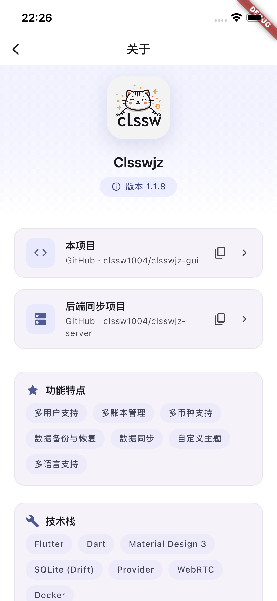
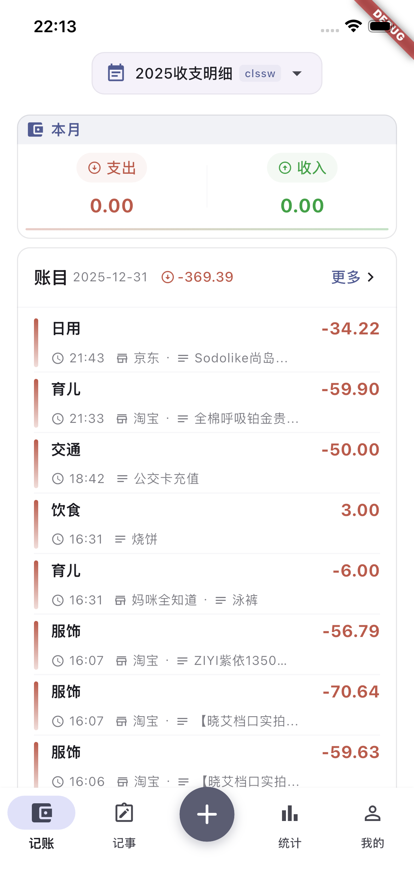
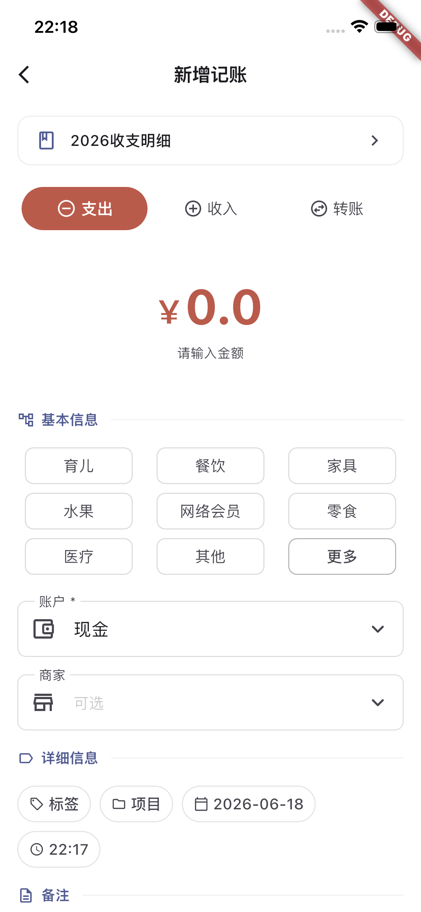
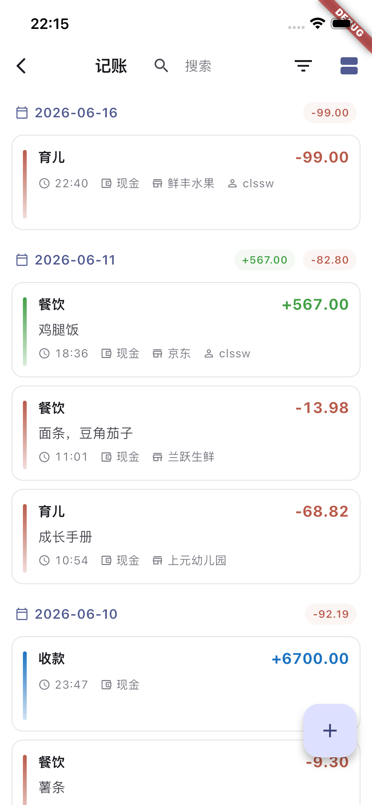
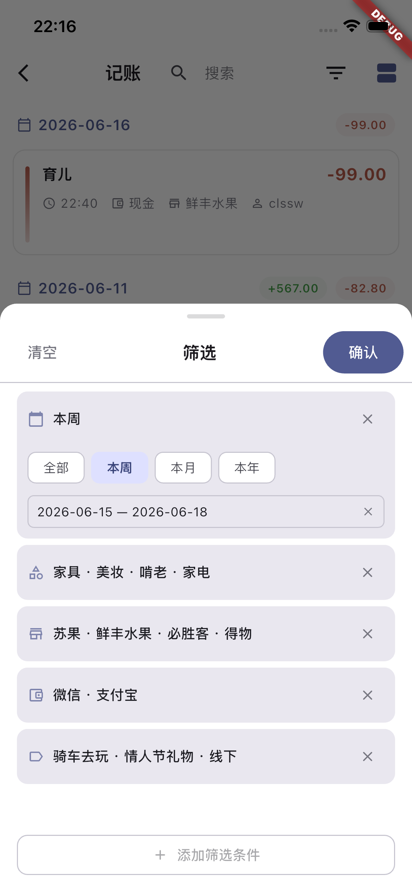
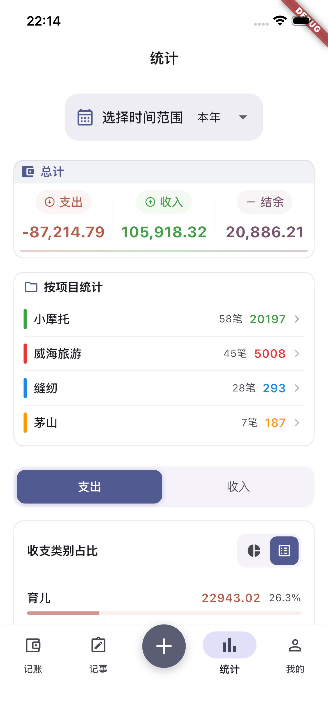
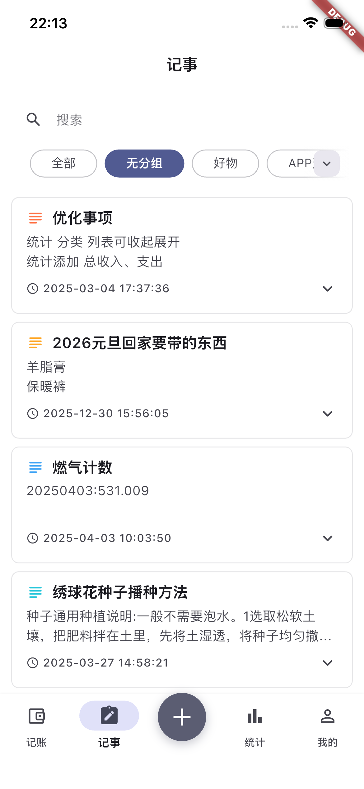
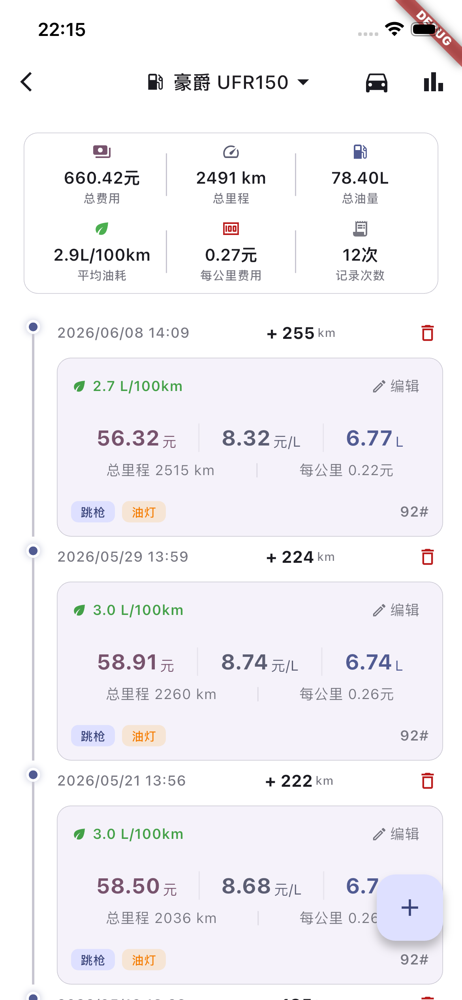
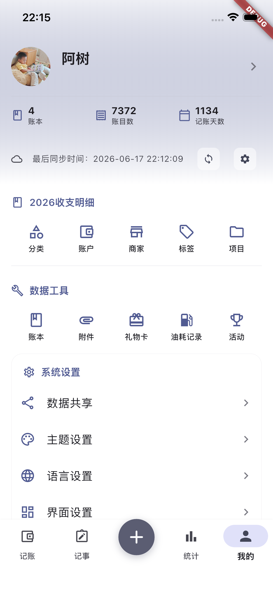

# Clsswjz

**GUI for [clsswjz-server](https://github.com/clssw1004/clsswjz-server)** — 私有的家庭/团队记账记事应用。后端可自托管（Node.js + Docker），客户端基于 Flutter 跨平台框架。

多账本、数据实时同步、离线可用。同时支持车辆油耗/礼物卡/活动打卡/债务管理/数据共享等扩展功能。

## 功能特点 ✨

### 📚 多账本

- 创建多个独立账本，数据互相隔离
- 账本成员管理与共享协作
- 成员级数据权限控制

### 💰 记账

- 收入、支出、转账记录
- 自定义分类、标签、商家、项目多维度记录
- 附件上传（票据、图片）
- 退款操作、关联账目
- 快速创建、拖拽排序的首页统计组件

### ⛽ 车辆油耗管理

- 多车辆管理（添加/编辑/删除）
- 加油记录：里程、油量、单价、总价（填二算一自动计算）
- 油品、跳枪/油灯标识、加油站、备注
- 油耗统计分析：平均油耗、总费用、总里程
- 加油记录快捷关联记账条目

### 🎁 礼物卡

- 我收到的 / 我送出的 双Tab切换
- 完整状态流转：草稿→已送出→已接收→已使用/已过期/已作废
- 支持永久有效、过期时间设置
- 邀请码搜索添加接收人

### 📝 记事

- 笔记（富文本编辑 + 附件）
- 待办事项
- 标签分类与分组筛选
- 活动记录（按日期记录活动）
- 活动打卡（每日打卡递增，按活动分组展示）

### 💳 债务管理

- 借入/借出记录
- 还款/收款跟踪
- 进度条直观展示完成状态
- 数据共享支持

### 📊 数据统计

- 收支趋势分析
- 分类占比统计（饼图）
- 自定义时间范围（全部/本年/本月/本周/自定义）
- 分类/商家/标签/项目点击跳转明细
- 月统计柱状图
- 多用户统计对比

### 🌐 多端同步

- 私有服务器部署，支持 NAS / 闲置服务器
- 实时数据同步
- 离线可用
- 日志驱动同步机制

### 🎨 个性化

- Material Design 3 设计语言
- 自定义主题颜色
- 深色模式支持

### 🔌 其他功能

- 数据权限：模块级用户间数据共享
- 国际化：简体中文 / 繁体中文 / English

## 下载

[Release 页面](https://github.com/clssw1004/clsswjz-gui/releases)

- **Android**: Google Play 内测中
- **iOS**: 需自行编译（需开发者账户）
- 应用内更新通知

## 后端部署

后端服务 [clsswjz-server](https://github.com/clssw1004/clsswjz-server) 提供 Docker 镜像，可直接部署在 NAS（需支持 Docker）或闲置服务器上。

## 页面截图

| 功能 | 截图 |
| ---- | ---- |
| **关于** |  |
| **账目流水** |  |
| **新增账目** |  |
| **账目列表** |  |
| **账目筛选** |  |
| **数据统计** |  |
| **记事** |  |
| **油耗记录** |  |
| **我的** |  |

## 本地编译 🚀

### 环境要求

- Flutter 3.29+
- Dart 3.5+
- Android Studio / VS Code
- Android SDK / Xcode（取决于目标平台）

### 安装步骤

```bash
# 克隆项目
git clone https://github.com/clssw1004/clsswjz-gui.git

# 安装依赖
cd clsswjz-gui
flutter pub get

# 运行
flutter run

# 构建 APK
flutter build apk

# 构建 iOS
flutter build ios
```

## 技术栈 🛠

| 技术 | 用途 |
|------|------|
| Flutter 3.29+ | 跨平台 UI 框架 |
| Dart 3.5+ | 开发语言 |
| Drift (SQLite) | 本地数据库 |
| Provider | 状态管理 |
| Material Design 3 | UI 设计系统 |
| Syncfusion Flutter Charts | 图表统计 |
| WebRTC | 视频聊天 |

### 架构分层

```text
UI (Pages/Widgets)
    ↕
Provider (ChangeNotifier)
    ↕
Driver (BookDataDriver)
    ↕
LogBuilder → DAO → Database + Sync
```

## 项目结构

```text
lib/
├── pages/           # 页面（按功能模块组织）
│   ├── tabs/        # 底部Tab页面
│   ├── book/        # 账本
│   ├── settings/    # 设置
│   ├── fuel/        # 车辆油耗
│   ├── gift_card/   # 礼物卡
│   ├── activity/    # 活动打卡
│   └── ...
├── providers/       # Provider 状态管理
├── services/        # 业务服务层
├── models/          # 数据模型
├── widgets/         # 通用组件
├── database/        # Drift 数据库定义
├── drivers/         # 数据驱动层（同步/日志）
├── manager/         # 管理器
├── routes/          # 路由配置
├── utils/           # 工具类
├── l10n/            # 国际化
└── theme/           # 主题配置
```

## 设计文档

- [DataDriver 新模块接入指南](docs/design/data_driver_guide.md)
- [礼物卡模块设计](docs/design/gift_card_design.md)
- [活动模块设计](docs/design/activity_design.md)
- [数据权限设计](docs/design/data_permission_design.md)
- [关联模块设计](docs/design/item_relation_design.md)
- [UI 设计规范](docs/design/ui_design.md)

## 开源协议 📄

MIT — 查看 [LICENSE](LICENSE) 文件了解详情

---

如果有任何问题或建议，欢迎在 [GitHub Issues](https://github.com/clssw1004/clsswjz-gui/issues) 中提出。
